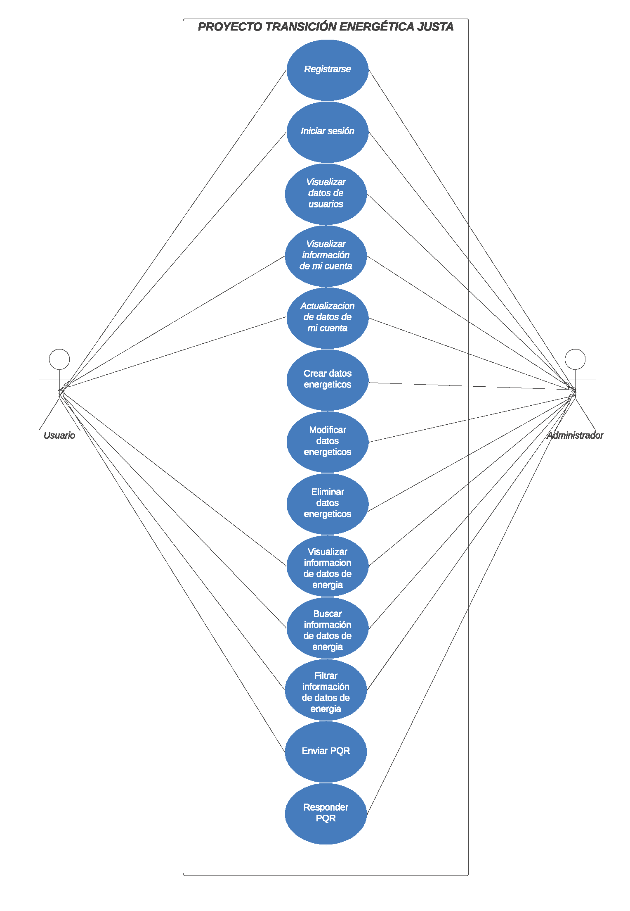
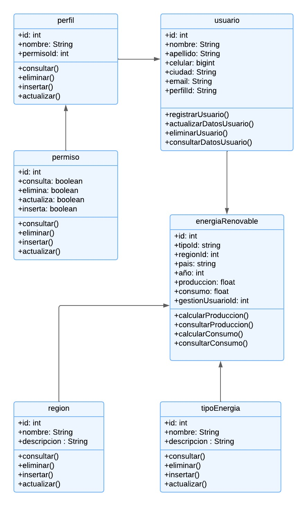

# Transición Energética Justa

 

 

#### Integrantes
- [Santiago Barrera Vergara](https://github.com/tiagob961127)
- [Carlos Martinez Morales](https://github.com/carlos7144)
- [Mayra Alejandra Marin López](https://github.com/malejamarin)
- [Larry Alejandro Nuñez Gomez](https://github.com/elskull)
- [Henry Alejandro Cáceres Téllez](https://github.com/tecnohalecatez)

#### Grupo 7
- Programación Integrador - Intermedio
- Colombia
- 2024

 
 
 

## Índice
1. Introducción
2. Requerimientos
3. Alcances
4. Desarrollo
5. Resultados esperados

 
 
 

## 1. Introducción
En un mundo que enfrenta desafíos ambientales crecientes, la transición hacia fuentes de energía sostenibles se ha convertido en un imperativo global. Este proyecto busca contribuir a este cambio mediante el desarrollo de una aplicación web que permite visualizar y gestionar datos sobre la producción y consumo de energía renovable a nivel Colombia. El acceso a esta información puede facilitar la toma de decisiones que promuevan la sostenibilidad y la justicia energética.

La aplicación, a través de tecnologías modernas y una arquitectura orientada a objetos en Java, permitirá a los usuarios analizar datos históricos y tendencias, promoviendo así una mayor concienciación y facilitando una transición energética informada.

**Problemática:** Existe una creciente necesidad de herramientas que faciliten el análisis y gestión de datos energéticos, con el fin de promover una transición hacia fuentes de energía renovables y sostenibles.

**Pregunta de investigación:** ¿Puede una aplicación web de gestión de datos energéticos facilitar la transición hacia un sistema energético más sostenible y justo?

**Hipótesis:** El acceso a datos visualizados y bien estructurados sobre producción y consumo de energía renovable fomenta una mayor conciencia y facilita una transición más justa y eficiente hacia un sistema energético sostenible.

 

**Objetivo General**

Desarrollar una aplicación web integral que permita la visualización y gestión de datos sobre la producción y el consumo de energía renovable a nivel Colombia. La plataforma ayudará a los usuarios a comprender tendencias energéticas y tomar decisiones informadas que promuevan la transición hacia un sistema energético más sostenible.

**Objetivos específicos**

- Diseñar y desarrollar una base de datos relacional que almacene datos históricos y actuales de producción y consumo de energía renovable.
- Implementar una interfaz web que permita a los usuarios visualizar tendencias a través de gráficos interactivos.
- Incluir funcionalidades de consulta avanzada para facilitar el análisis comparativo.
- Garantizar la escalabilidad y seguridad del sistema mediante el uso de buenas prácticas de desarrollo y despliegue.

 
 
 

## 2. Requerimientos

#### Nivel 1: Básicos
- **Modelado del sistema orientado a objetos:** La aplicación debe modelar los datos energéticos utilizando clases y métodos en Java, que permitan representar la producción y consumo de energía renovable.
- **Gestión de usuarios:** Implementación de funcionalidades para el registro, inicio de sesión y gestión de perfiles de usuario, utilizando principios de seguridad y buenas prácticas de desarrollo en Java.

#### Nivel 2: Intermedios
- **Base de datos relacional:** Diseño de una base de datos relacional que almacene los datos históricos de energía renovable y la información de usuarios.
- **Operaciones y consultas SQL:** Conexión de la aplicación a la base de datos para ejecutar consultas SQL, incluyendo:
  - Obtener la producción total de energía renovable por tipo de fuente en un año específico y por región.
  - Calcular el porcentaje de energía renovable en el consumo eléctrico total por región.
  - Identificar tendencias de capacidad instalada de energía solar a lo largo de los años.
  - Mostrar las fuentes de energía y su participación en el consumo eléctrico.

#### Nivel 3: Avanzados
- **Visualización y experiencia del usuario:** Presentación de los resultados en formato tabular e interactivo, con gráficos que representen las consultas SQL de manera visual y comprensible.
- **Interactividad y responsividad:** Implementación de gráficos interactivos, tablas responsivas, búsqueda en tiempo real, validación de formularios y actualización dinámica de contenido para mejorar la experiencia del usuario.

 
 
 

## 3. Alcances
Este proyecto abarca:
- **Desarrollo de una aplicación web:** Creación de una interfaz amigable y moderna para la visualización y gestión de datos energéticos.
- **Visualización de datos energéticos históricos y en tiempo real:** Integración de gráficos interactivos y tablas que muestren tendencias y estadísticas relevantes.
- **Implementación en producción:** La aplicación estará disponible en un entorno de producción, accesible para usuarios finales, cumpliendo con estándares de seguridad y diseño responsivo.

 
 
 

## 4. Desarrollo

- Análisis de requerimientos:
  - **Funcionales:** Registro y autenticación de usuarios, gráficos interactivos, filtros avanzados por región/tecnología/año, exportación de datos en formato .csv o .pdf.
  - **No funcionales:** Escalabilidad, tiempos de respuesta menores a 2 segundos, cumplimiento de estándares de seguridad OWASP.
- Arquitectura de software:
  - **Backend:** Java - Spring Boot.
  - **Frontend:** React.js o Angular.
  - **Base de datos:** MySQL.
  - **Despliegue:** Heroku, AWS o Azure.
- Diagrama de casos de uso:

- Diagrama de clases:

- Desarrollo técnico:
  - **Backend:**
	  - Modelos de dominio siguiendo principios de POO.
	  - Controladores RESTful para exponer servicios.
  - **Frontend:**
	  - Diseño responsivo con visualización gráfica (Chart.js o D3.js).
  - **Integración:** APIs externas para datos actualizados del gobierno o proveedores.
- Pruebas:
  - Plan de pruebas unitarias, de integración y de interfaz de usuario.
  - Herramientas: JUnit, Postman, Selenium.

 
 
 

## 5. Resultados esperados

- **Prototipo funcional:**
  - Plataforma operativa accesible vía navegador, con un diseño intuitivo y centrado en el usuario.
- **Base de datos:**
  - Almacenamiento eficiente de datos históricos y actualizados.
- **Impacto social:**
  - Usuarios informados sobre las tendencias energéticas en Colombia.
- **Indicadores de éxito:**
  - Tiempo de respuesta < 2 segundos para consultas grandes.
  - Capacidad de la plataforma para manejar al menos 1.000 usuarios concurrentes.
  - Visualización de datos energéticos para los últimos 10 años de al menos 10 fuentes renovables.